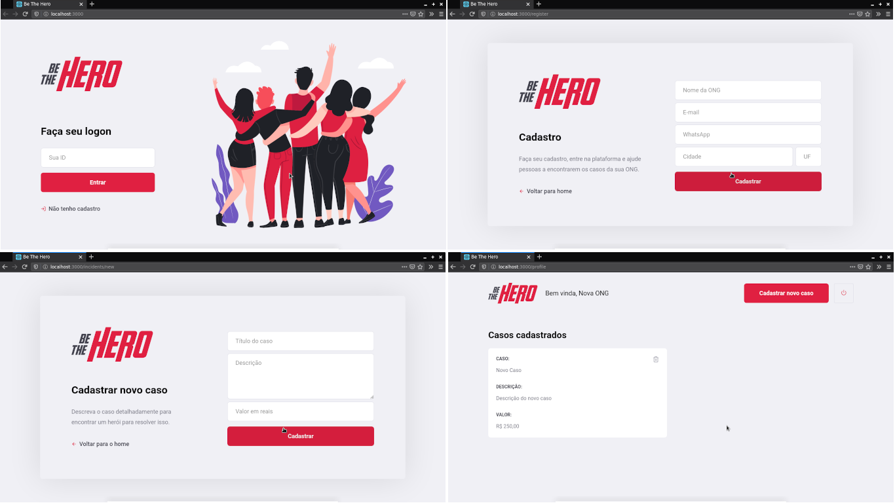
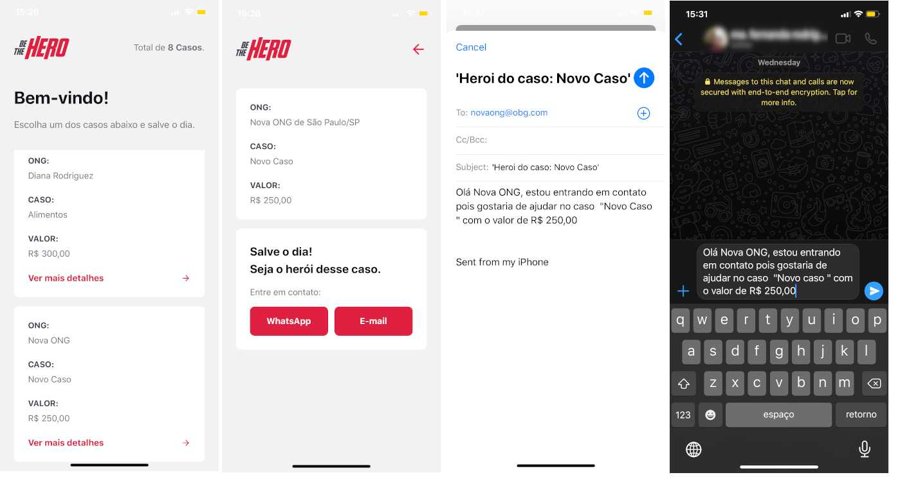

# Semana OmniStack 11.0

O projeto *"Be The Hero"* é uma aplicação *mobile* e *web*, em que ONGs podem cadastrar casos que precisam de ajuda, e pessoas interessadas podem verificá-las e ajudá-las financieramente.  

## Ambiente de desenvolvimento

As seguintes tecnologias foram utilizadas no projeto:

* **Back-end**

	* [Node.js](https://nodejs.org/): Plataforma para criar facilmente aplicativos de rede rápidos e escaláveis.

* **Front-end**

	* [React.js](https://reactjs.org/): Uma biblioteca JavaScript para criar interfaces de usuário.

* **Mobile**

	* [React Native](https://reactnative.dev/): Cria aplicativos nativos para Android e iOS.

	* [Expo](https://expo.io/): Plataforma de código aberto para criar aplicativos nativos universais para Android, iOS e web com JavaScript e React.

## Resultados

### Web

### Mobile

## Insomnia

## Licença